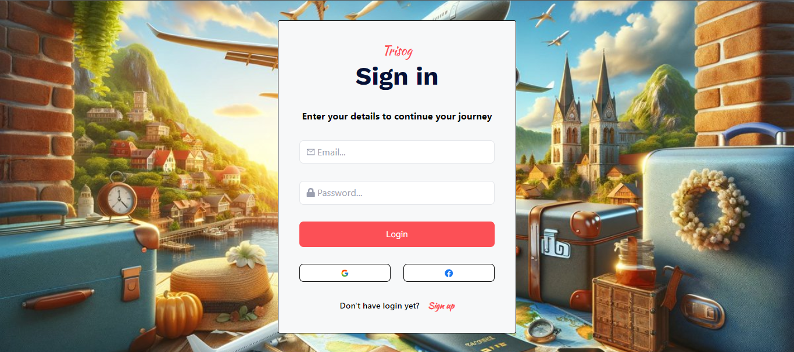

# Desafio 3 - Semana 12

## Desafio 3 - Semana 12 - SP - FullStack Journey (Node.js&React) - AWS Cloud Context - Compass UOL

# Travel Agency Frontend

<div align="center">
  <br/>
  
</div>


This is the frontend application for the Travel Agency project. It is built with React, Vite, and includes various libraries for a rich user experience.

## Table of Contents

1. [Installation](#installation)
2. [Usage](#usage)
3. [Configuration](#configuration)
4. [Project Structure](#project-structure)
5. [Authors](#authors)
6. [References and Links](#references-and-links)

## Installation

To set up the project locally, follow these steps:

1. Clone the repository:
   ```bash
   git clone https://github.com/DiegoOtani/Desafio-3--Semana-12-Front.git
   cd travel-agency-frontend

2.    Install Dependencies:
      ```
      npm install
      ```
## Usage

To start the app, use:

```
  npm run dev
```
## Configuration

Create a `.env` file in the root directory to configure environment variables. Example:

```
  VITE_FIREBASE_API_KEY=your_firebase_api_key
  VITE_FIREBASE_AUTH_DOMAIN=your_firebase_auth_domain
  VITE_FIREBASE_PROJECT_ID=your_firebase_project_id
  VITE_FIREBASE_STORAGE_BUCKET=your_firebase_storage_bucket
  VITE_FIREBASE_MESSAGING_SENDER_ID=your_firebase_messaging_sender_id
  VITE_FIREBASE_APP_ID=your_firebase_app_id
```

## Project Structure

- public/: Public assets
- src/: Source code
  - components/: React components
  - helpers/: date helper and icon helper
  - interfaces/: interfaces ts to receive data with type
  - pages/: Page components
    - Home/: Home page
    - Login/: Login page
    - Tour/: Tour page
    - TourDetails/: TourDetails page
  - routes/: Route definitions
  - services/: API services and Firebase configuration
  - styles/: Global styles and Tailwind configuration
- vite.config.ts: Vite configuration
- tsconfig.json: TypeScript configuration
- tailwind.config.js: Tailwind configuration

## Authors

- Diego Otani

##  References and links

- React Documentation: https://react.dev/
- Vite Documentation: https://vitejs.dev/
- Tailwind CSS Documentation: https://tailwindcss.com/docs/installation
- Leaflet Documentation:  https://leafletjs.com/
- Firebase Documentation: https://firebase.google.com/docs?hl=pt
- Splide: https://splidejs.com/integration/react-splide/